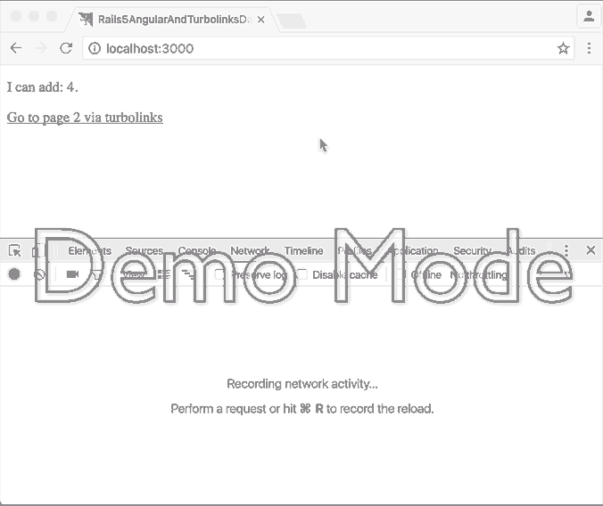

# Demo: Angular and Turbolinks together



## Why?

As demo application for stackoverflow: http://stackoverflow.com/a/15488920/2066546

For the individual steps, take a look at the [commits](https://github.com/fiedl/rails-5-angular-and-turbolinks-demo/commits/master).

## Versions

* Rails 5.0
* Angular 1.5.8

## Setup

```bash
git clone git@github.com:fiedl/rails-5-angular-and-turbolinks-demo.git
cd rails-5-angular-and-turbolinks-demo.git
bundle install
bin/rails server
```

Next, visit http://localhost:3000.

## License

(c) 2016, fiedl. MIT License.
